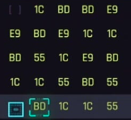
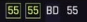

# Сценарий игры

Игрок должен за отведенное время и количество шагов выбрать нужные комбинации цифр и символов в матрице 5х5 в порядке, указанном в последовательности. Выбор начинается с верхней строчки, второй кусок кода выбирается из столбца, в котором находился первый кусок выбранного кода, третий – из строчки, в которой находился второй выбранного кода и так далее. Выбранные куски кода исчезают из матрицы. Обратный отсчет начнется с момента запуска раунда. Количество последовательностей, необходимых для победы, время и ограничение ходов меняется со сложностью игры.

Легая сложность:
1 последователность из 4 кусков кода;
4 шага;
30 секунд раунда.

Средняя сложность:
2 последователности из 3х кусков кода;
7 шагов;
40 секунд раунда.

Тяжелая сложность:
3 последователности из 2х/3х/3х кусков кода;
9 шагов;
1 минута раунда.

Пример матрицы

Пример последовательности

_TODO:_

- [ ] Реализовать систему поощрений, в виде ачивок.

_Хотелки:_

- [ ] Реализовать анимации для переходов по матрице, удаления кусков кода, успешного или нет завершения последовательности.
- [ ] Добавить возможность изменения размера матрицы для получения большего количества очков.
